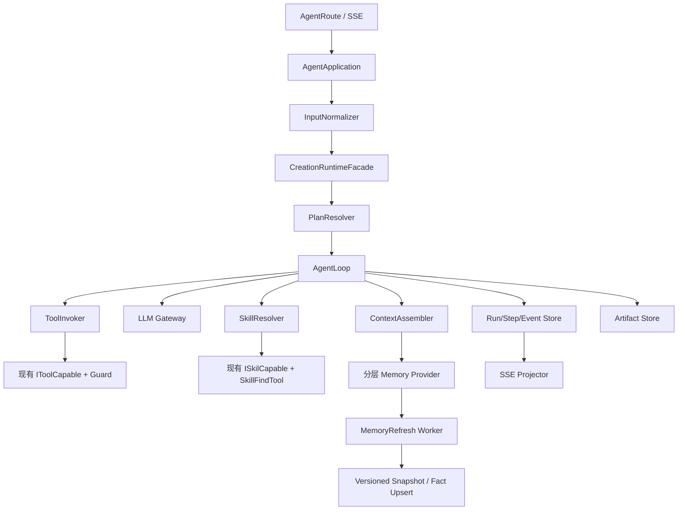

# ADR-004：以 AgentLoop 为核心重构 AI 编排、多 Agent 与记忆链路

## Status

In Progress

## Date

2026-08-21

## 决策摘要

当前 AI 核心链路不采用 `ReActAgent` 作为运行时核心，也不再抽取一个只服务于 ReAct 的
`ReActTurnExecutor`。改为建设内部 `AgentLoop`：一个由状态机驱动的、可暂停/取消/恢复、可
审计的 Agent 执行内核。

`AgentLoop` 不规定模型必须输出 Thought/Action/Observation，也不把“ReAct”作为公共协议。
模型可以直接回答，也可以请求 Tool 或 Skill；循环的继续条件、预算、权限、幂等和事件由
`AgentLoop` 控制。这样既保留当前 Function Calling、Tool、Skill 和 SSE，又为后续多 Agent
DAG、人工确认和恢复执行提供稳定边界。

记忆采用分层模型：请求输入、最近完整轮次、会话摘要、作品级结构化事实、按需检索内容。
消息提交与记忆刷新解耦，记忆以版本化快照和事实 Upsert 写入，旧版本不能覆盖新版本。

## 1. 背景与问题

当前入口为：

```text
AgentRoute
  → AgentApplication
  → CreationSessionManager
  → CreationOrchestrator
  → INovelAgent / ReActAgent
  → ToolCapable / SkillCapable
  → AICreationMessages / MemorySnapshots
```

已发现的问题：

1. `AgentBase` 与 `ReActAgent` 各自维护循环，错误、迭代、Tool 回填和 Token 统计容易分叉。
2. `CreationOrchestrator` 同时负责路由、上下文、Agent 调度和 SSE 投影，职责过重。
3. 多 Agent 通过拼接长字符串传递结果，没有结构化 Artifact、预算和依赖契约。
4. 没有统一的 Run/Step/ToolCall 状态，无法可靠支持取消、恢复、重试、幂等和审计。
5. `SkillName`、`EnableAutoToolDispatch` 尚未完整贯穿 Chat → Orchestrator → Agent。
6. 客户端消息数量、长度和重复提交没有统一边界。
7. Chat 提交消息后同步刷新记忆；摘要失败可能让已经提交的 Chat 返回失败。
8. `MemorySnapshot` 当前是每轮追加，缺少唯一版本约束，并发刷新可能让旧摘要覆盖新摘要。
9. 上下文按消息条数截断，可能拆开 user/assistant 完整轮次；摘要和最近原文还可能重复注入。

## 2. 目标与非目标

### 目标

- 以 `AgentLoop` 统一单 Agent 与多 Agent Step 的执行生命周期。
- 保留现有 Tool 名称、参数 Schema、`IToolCapable`、Tool Guard、Skill 查找和 SSE 事件类型。
- 保留 `INovelAgent`、`IReActAgent` 等兼容入口，迁移期间可通过 Facade 回滚。
- 让多 Agent 通过经过校验的 Plan 和 Artifact 传递内容，不依赖无限增长的字符串拼接。
- 引入 Run、Step、ToolCall、Artifact、事件序列和幂等键，支持取消、恢复和审计。
- 让记忆刷新异步化、版本化、可观测，并将项目事实从会话摘要中分离出来。
- Chat 入口在规范化输入、会话创建、运行创建和持久化之间保持一致性。

### 非目标

- 不引入第三方 Agent Framework 或微服务。
- 不要求模型暴露或生成 Thought 文本。
- 不一次性重写所有 Agent、Tool、Skill 和提示词。
- 不默认开启多 Agent 并行；有副作用的 Agent/Tool 始终串行。
- 第一阶段不做完整向量数据库替换，检索能力按需接入。

## 3. 架构决策

采用“模块化单体 + AgentLoop 内核 + 业务适配层 + 分层记忆”的结构：



边界原则：

- Agent 定义能力和默认参数；`AgentLoop` 决定执行流程、预算和生命周期。
- PlanResolver 决定执行哪些 Agent；AgentLoop 只执行当前 Step，不负责业务路由。
- Tool/Skill 是受授权的能力提供者，不能自行改变 Run 状态或越权访问作品。
- SSE 是 Runtime 事件的投影，不是核心状态存储。
- Memory Provider 只提供上下文所需的记忆视图；摘要和事实刷新由后台任务完成。

## 4. AgentLoop 核心模型

### 4.1 公共接口

建议在 `SpeakEase.AI.Lib/Runtime/` 增加以下抽象：

```csharp
public interface IAgentLoop
{
    IAsyncEnumerable<AgentEvent> RunAsync(
        AgentLoopRequest request,
        CancellationToken cancellationToken = default);
}

public sealed class AgentLoopRequest
{
    public string RunId { get; init; }
    public string StepId { get; init; }
    public string AgentName { get; init; }
    public string UserMessage { get; init; }
    public IReadOnlyList<ChatMessage> ConversationHistory { get; init; }
    public string SystemPrompt { get; init; }
    public AgentLoopOptions Options { get; init; }
    public string SkillName { get; init; }
    public bool EnableAutoToolDispatch { get; init; }
}

public sealed class AgentLoopOptions
{
    public int MaxIterations { get; init; } = 10;
    public int MaxToolCalls { get; init; } = 30;
    public int MaxOutputTokens { get; init; } = 2048;
    public int ContextWindowTokens { get; init; } = 32_000;
    public TimeSpan RunTimeout { get; init; } = TimeSpan.FromMinutes(5);
    public bool AllowParallelReadOnlyTools { get; init; }
}
```

`AgentLoop` 的结果不以 `ReActAgent` 类型暴露，而通过事件和最终状态表达：

```csharp
public sealed class AgentEvent
{
    public string RunId { get; init; }
    public string StepId { get; init; }
    public long Sequence { get; init; }
    public string Type { get; init; }
    public object Payload { get; init; }
    public DateTimeOffset CreatedAt { get; init; }
}

public enum AgentRunStatus
{
    Created,
    Running,
    WaitingTool,
    Completed,
    Failed,
    Cancelled,
    MaxIterationsReached,
    TimedOut
}
```

### 4.2 一次 Loop 的状态转换

```text
RunCreated
  → InputNormalized
  → ContextAssembled
  → ModelTurnStarted
  → ModelTurnCompleted
      ├─ FinalAnswer → StepCompleted
      ├─ ToolCallRequested → ToolAuthorized → ToolExecuting
      │                     → ToolCompleted → MessagesAppended → ModelTurnStarted
      ├─ SkillRequested → SkillResolved → MessagesAppended → ModelTurnStarted
      └─ Invalid/Denied → StepFailed
  → RunCompleted / RunFailed / RunCancelled / MaxIterationsReached
```

每次状态迁移都产生单调递增的 `Sequence`。状态机负责：

- 检查取消、超时、最大迭代、最大 Tool 次数和输出预算；
- 校验 Tool 参数、权限和幂等键；
- 将 Assistant ToolCall 与 ToolMessage 成对回填；
- 区分 LLM 错误、Tool 错误、Skill 错误、策略拒绝和取消；
- 产出 `FinalAnswer` 或带明确 `StopReason` 的失败结果。

Loop 不输出 Thought/Action 等内部推理字段。`reasoning` SSE 类型若仍需兼容，只允许承载
现有安全的摘要或状态信息，不持久化隐藏推理内容。

### 4.3 Tool 与 Skill 兼容适配

保留以下现有能力和调用约定：

```text
ToolDefinition / ToolCall / ToolResult
IToolCapable.ExecuteAsync
WorkToolExecutionGuard
ISkilCapable / SkillCapable / SkillFindTool
SKILL.md 与 /ai/agent/skills API
```

新增 Runtime 侧适配器：

```csharp
public interface IToolInvoker
{
    Task<ToolResult> InvokeAsync(
        ToolCall call,
        AgentToolExecutionContext context,
        CancellationToken cancellationToken = default);
}

public interface ISkillResolver
{
    Task<SkillContent> ResolveAsync(
        string skillName,
        CancellationToken cancellationToken = default);
}
```

`LegacyToolInvokerAdapter` 委托现有 `IToolCapable` 和 Guard；
`LegacySkillResolverAdapter` 委托 `ISkilCapable`、`SkillFindTool` 和现有 Skill 文件。不要直接
删除历史拼写接口 `ISkilCapable`、`RegiSkill`，稳定后再标记 `Obsolete`。

### 4.4 多 Agent Plan 与 Artifact

当前 `RouteResult.Pipeline` 先转换为线性 Plan，后续扩展为受约束 DAG：

```json
{
  "steps": [
    { "id": "write", "agent": "write", "dependsOn": [] },
    { "id": "critique", "agent": "critique", "dependsOn": ["write"],
      "input": { "artifact": "write.final" } }
  ]
}
```

PlanResolver 必须校验 Agent 存在、Step 唯一、依赖存在、无环、Step 数量和权限不超限。
模型只能选择已注册能力，不能通过 Plan 提升 Tool/Skill 权限。

```csharp
public sealed class AgentArtifact
{
    public string Id { get; init; }
    public string RunId { get; init; }
    public string StepId { get; init; }
    public string ContentType { get; init; }
    public string Summary { get; init; }
    public string Content { get; init; }
    public int EstimatedTokens { get; init; }
}
```

后续 Step 默认接收 Artifact 摘要，只有在剩余 Token 预算允许时才附带正文；禁止把所有前序
输出无限拼接到 `UserMessage`。

## 5. 记忆架构

### 5.1 分层模型

```text
L0 Request Input       本次请求规范化后的用户消息、SkillName、运行选项
L1 Turn Context         最近 2~4 个完整 user/assistant 轮次及必要 Tool 结果
L2 Session Memory       当前会话较早历史的摘要、未完成任务、会话约束
L3 Project Memory      作品级结构化事实：角色、世界观、章节、写作约束、伏笔、用户偏好
L4 Retrieval Memory    按当前意图检索的章节片段、历史事实和相关 Artifact
```

读取顺序固定为 `L3 → L2 → L4 → L1 → L0`，最终按优先级和 Token 预算组装为消息。最近原文
与摘要不能覆盖同一轮：L1 使用的轮次必须从 L2 的摘要范围中排除。

### 5.2 结构化数据模型

现有 `MemorySnapshot` 继续作为会话摘要载体，但改为“同一范围一个最新版本”：

```csharp
public sealed class MemoryFact
{
    public string Id { get; init; }
    public string UserId { get; init; }
    public string WorkId { get; init; }
    public string SessionId { get; init; }
    public string Category { get; init; }
    public string Key { get; init; }
    public string Value { get; init; }
    public string SourceTurn { get; init; }
    public double Confidence { get; init; }
    public bool IsCurrent { get; init; }
    public int VersionTurn { get; init; }
}
```

建议的 `Category`：`character`、`world_rule`、`chapter_fact`、`writing_constraint`、
`plot_thread`、`user_preference`。事实必须带来源轮次和置信度，低置信度只作为候选，不直接
覆盖高置信度事实。

`MemorySnapshot` 增加或映射为以下字段：

```text
(UserId, WorkId, SessionId, SnapshotType)  唯一键
VersionTurn                                  单调版本
CoveredFromTurn / CoveredToTurn              摘要覆盖范围
MemoryStatus                                 fresh / refreshing / stale / failed
UpdatedAt                                    版本更新时间
```

数据库写入和缓存刷新都必须先比较 `VersionTurn`。Turn 2 的刷新先完成时，Turn 1 完成后只能
被丢弃，不能覆盖 Turn 2。

### 5.3 写入流程：消息先提交，记忆异步刷新

```text
Chat 接收请求
  → 创建/复用 Session 与 AgentRun（幂等）
  → AgentLoop 执行 Tool/Skill/LLM
  → 事务提交 user、tool、assistant 消息和 Run 结果
  → 发布 MemoryRefreshRequested(user, work, session, turn, runId)
  → Chat 返回 completed

MemoryRefreshWorker
  → 读取最近完整轮次
  → 生成 Session 摘要
  → 提取/合并 Project Memory Facts
  → 按 VersionTurn Upsert Snapshot/Facts
  → 条件刷新缓存
  → 标记 fresh；失败则标记 stale 并重试
```

记忆刷新失败不能让已提交的 Chat 失败。队列至少需要 `RunId`、会话、轮次、重试次数和
幂等键；重复消息只保留更新版本。

### 5.4 上下文组装策略

`CreationAgentContext` 改为按完整 Turn 选取历史，而不是直接 `Take(8)` 条消息：

1. 查询最近 TurnNumber，并选出最近 2~4 个完整轮次；
2. 排除已包含在 L2 摘要范围内的轮次；
3. 加载对应的 user/assistant，按需要加载本轮 Tool 结果；
4. 注入 L3 结构化事实和 L4 检索片段；
5. 根据模型真实上下文窗口计算 `input + reserved output <= window`；
6. 先裁剪 L4，再裁剪 L2，最后减少 L1，但不能拆分一个完整轮次；
7. 单条超长系统消息必须硬截断或压缩，不能因为消息数为 1 而跳过预算控制。

推荐预算（可配置）：

```text
System/Agent Prompt       15%
Project Facts (L3)        15%
Session Summary (L2)      20%
Retrieval (L4)            20%
Recent Turns (L1)         30%
Reserved Output           单独预留，不能挤占输入预算
```

### 5.5 缓存与失效

缓存键保持会话隔离：

```text
memory:session:{userId}:{workId}:{sessionId}
memory:project:{userId}:{workId}
```

缓存值必须包含 `VersionTurn`。读取时若发现缓存版本低于数据库版本，直接回源；写入时使用
条件刷新或版本比较，禁止无条件覆盖。回滚、会话取消、作品事实修改时分别失效 Session、
Project 或两者缓存。

## 6. Chat 入口与输入一致性

### 6.1 输入规范化

`AgentChatRequestDto` 保留现有字段，并增加：

```csharp
public string ClientMessageId { get; set; }
public string IdempotencyKey { get; set; }
```

`InputNormalizer` 统一执行：

- 只接受 `user`、`assistant` 两类客户端历史；客户端不能注入 `system`、`tool`；
- 当前请求必须有且只有一个非空 user 消息，历史消息按顺序保留；
- 限制消息数、单条字符数和请求体大小，超限返回 400，不在下游静默截断；
- 标准化空白、控制字符和 SkillName；
- 将 `SkillName`、`EnableAutoToolDispatch`、温度、MaxTokens、MaxIterations 原样传入
  `AgentRuntimeRequest`，再由 Runtime 做上限裁剪。

### 6.2 会话、Run 与幂等

`GetActiveSessionAsync → StartSessionAsync` 改为单次原子 Get/Create，配合作品和用户维度的
唯一约束，避免并发请求创建两个活跃会话。每次 Chat 创建 `AgentRun`：

```text
Created → Running → Completed
                    ├─ Failed
                    ├─ Cancelled
                    ├─ TimedOut
                    └─ MaxIterationsReached
```

`IdempotencyKey` 或 `ClientMessageId` 在同一 user/work/session 范围唯一。重试请求返回已有 Run
结果，不重复写入消息，也不重复执行有副作用的 Tool。

### 6.3 流式断开与副作用

SSE 断开只代表投影连接关闭，不自动判定 Run 成功。Runtime 必须继续记录最终状态；无法完成
时标记 `cancelled` 或 `failed`。有副作用的 Tool 在执行前写入 `ToolCall`（含 RunId、参数
哈希和幂等键），恢复或重试时先查询 ToolCall 状态，禁止重复执行。

## 7. 兼容与迁移方案

### 阶段 0：行为冻结

- 冻结现有 Tool 名称、参数 Schema、Guard 和结果格式；
- 冻结 Skill 查找、`SKILL.md` 路径和现有 SSE 事件类型；
- 补齐 LLM 错误、Tool 错误、取消、断流和最大迭代测试；
- 增加 `AiRuntime:Mode=legacy|agent-loop` 开关。

### 阶段 1：AgentLoop 内核

- 在 `SpeakEase.AI.Lib/Runtime/` 实现 `AgentLoop`、状态、事件和预算策略；
- `LegacyToolInvokerAdapter`、`LegacySkillResolverAdapter` 接入现有 Tool/Skill；
- `AgentBase`、`ReActAgent` 暂作为兼容 Facade，内部委托 AgentLoop；
- 不改变 `/ai/agent/chat`、`/ai/agent/chat/stream` 的请求和 SSE 类型。

### 阶段 2：Runtime Facade 与 Run

- 新增 `CreationRuntimeFacade`，由它把路由结果转换为 Plan；
- `CreationOrchestrator` 降级为兼容 Facade，不再实现循环和上下文拼接；
- 增加 `AgentRuns`、`AgentRunSteps`、`AgentRunEvents`、`AgentToolCalls`、`AgentArtifacts`；
- SSE `meta` 增加 `runId`、`stepId`、`sequence`，旧字段保持不变。

### 阶段 3：记忆解耦与版本化

- `AppendTurnAsync` 提交消息后发布 `MemoryRefreshRequested`，不等待摘要；
- `MemorySnapshot` 按唯一键和 `VersionTurn` Upsert；
- `CreationAgentContext` 改为完整 Turn 裁剪和分层预算；
- 增加 `MemoryFact`，先支持结构化写入和读取，检索按需接入。

### 阶段 4：多 Agent DAG 与恢复

- 线性 Pipeline 稳定后再开放 DAG；
- 默认串行，只有明确声明只读且无依赖的 Step 才允许并行；
- 支持从最近一个未完成 Step 恢复，已完成的幂等 Tool 不重复执行；
- 稳定后移除旧循环实现，但保留协议兼容层。

## 8. 方案取舍

| 方案 | 结论 | 说明 |
|---|---|---|
| 继续以 `ReActAgent` 为核心 | 不采用 | 抽象绑定 ReAct 叙事，难以覆盖直接回答、人工确认和恢复状态 |
| 抽取 `ReActTurnExecutor` | 不采用 | 只是把旧循环搬家，仍以 ReAct 为中心，不能统一 Run/Step/Artifact |
| 继续扩展 `CreationOrchestrator` | 不采用 | 路由、循环、上下文和 SSE 会继续耦合 |
| 引入第三方 Agent Framework | 不采用 | 现有 Tool、Skill、数据库、SSE 和权限边界需要大量适配 |
| 内部 AgentLoop + 兼容适配器 | 采用 | 复用现有能力，能逐阶段迁移和回滚，核心不依赖 EF Core |

接受的代价：需要新增 Run/事件/队列模型，并处理最终一致性；通过幂等键、版本 Upsert、
`stale` 状态、重试和可观测指标控制风险。

## 9. 验收标准

- 现有 Tool 名称、参数 Schema、Guard 和 ToolResult 行为不变；
- `find_skill`、现有 `SKILL.md` 和 `/ai/agent/skills` 仍可使用；
- AgentLoop 能处理直接回答、Tool Call、Skill Resolve、取消、超时和最大迭代；
- AgentBase/ReActAgent 仅作为兼容入口，核心循环不再由它们维护；
- 单 Agent 和当前线性 Pipeline 的 SSE 事件类型保持兼容；
- Chat 重试不会重复写消息或重复执行有副作用 Tool；
- 记忆刷新失败不会让已提交的 Chat 返回失败；
- 同一 Session 的旧 MemorySnapshot/缓存不能覆盖新版本；
- 上下文按完整轮次裁剪，`input + reserved output <= context window`；
- Runtime 核心不直接引用 EF Core、用户上下文和作品实体；
- 单元测试覆盖状态转换、预算、幂等、版本冲突、取消和记忆刷新重试。

## 10. 推荐下一步

第一步实现 `AgentLoop` 的最小内核和兼容适配器，第二步补 `AgentRun + IdempotencyKey`，
第三步把记忆刷新改为后台队列并完成 Snapshot 版本化，最后再把 `CreationOrchestrator`
收敛为 Facade。这样每一步都能在保留当前 Tool/Skill/SSE 的前提下独立验证和回滚。

## 11. 当前实现对照

本次执行已完成以下基础能力：

- `IAgentLoop`、`AgentEvent`、`AgentLoopOptions` 和 AgentLoop 预算边界；
- `AgentRun`、`AgentRunEvent`、`AgentArtifact`、`AgentToolCall` 数据模型，其中 Run 去重和事件持久化已接入 Chat；
- `PlanResolver` 线性 Plan 校验，以及多 Agent 之间的结构化 Artifact 传递；
- `MemoryFact`、会话摘要覆盖范围、版本化 Snapshot 和项目事实读取/Upsert；
- Tool/Skill 兼容入口、`LegacySkillResolverAdapter`、取消/超时/最大 Tool 次数处理；
- Chat 重试的 `IdempotencyKey`/`ClientMessageId` 去重和最终响应持久化；
- `IToolExecutionJournal`、ToolCall 执行租约、完成结果 Replay 和并发唯一键竞争处理；
- 记忆刷新后台队列按会话合并最新请求，回滚时同步裁剪未来轮次事实；
- SSE Chunk 统一携带 RunId、StepId 和运行级单调 Sequence，断流取消和超时会持久化 Run 终态。

仍需后续阶段完成的事项：

- 将 `CreationOrchestrator` 进一步收敛为 `CreationRuntimeFacade`，把路由和上下文组装拆到独立组件；
- 将事实提取从当前显式 `[[fact:category:key=value]]` 兼容标记升级为受约束的事实提取器；
- 增加未完成 Step 的运行恢复，以及取消、幂等冲突和数据库并发场景的集成测试。
