# AgentRuntime 参考架构草案

## 状态

Accepted — Runtime Phase 1 Implemented（2026-09-06）

## 目标

本方案提取三类开源 AgentRuntime 的共同机制，并映射到 AINWZ 当前后端：

- AutoGen：消息路由、Agent identity、Runtime 生命周期；
- LangGraph：状态图、checkpoint、interrupt/resume、durable execution；
- OpenAI Agents SDK：Runner、RunContext、Tool invocation、streaming event。

实现目标是建设内部 `AgentLoop/AgentRuntime`，不引入第三方框架，不采用 `ReactAgent` 作为核心，且保持以下兼容性：

1. 现有 API 路径、请求/响应结构保持不变；
2. 现有 SSE 事件类型和客户端可见字段保持不变；
3. 现有 Tool 名称、参数 Schema、Guard 和返回契约保持不变；
4. 现有数据库表和历史数据继续可读写，不要求一次性迁移；
5. 现有 `INovelAgent`、`ReActAgent`、`IToolCapable`、`ISkilCapable` 保留兼容入口。

## 一、总体架构图

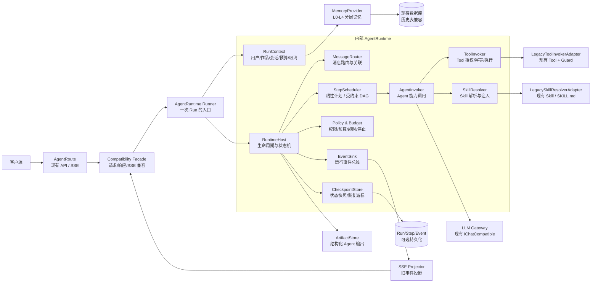

### 图中职责

| 部件 | 借鉴来源 | 在 AINWZ 中的职责 |
|---|---|---|
| `Runner` | OpenAI Agents SDK Runner | 接收一次 Chat 请求，创建/恢复 Run，并返回事件流和最终结果 |
| `RunContext` | OpenAI Agents SDK RunContext | 保存用户、作品、会话、请求选项、取消令牌、预算和依赖，不放入 Prompt 文本 |
| `MessageRouter` | AutoGen Runtime | 使用结构化消息在 Agent、Tool、Skill、Runtime 之间传递结果 |
| `RuntimeHost` | AutoGen Runtime lifecycle | 驱动 Run/Step 状态、错误边界、取消、超时和终态落盘 |
| `StepScheduler` | LangGraph StateGraph | 执行线性 Pipeline；后续支持经过校验的 DAG，不允许任意模型跳转 |
| `CheckpointStore` | LangGraph checkpoint | 保存可恢复的执行状态、当前节点、消息游标和待处理 ToolCall |
| `EventSink` | 三者共同机制 | 产生内部统一事件；SSE 只是兼容投影，不作为 Runtime 内部协议 |
| `ToolInvoker` | OpenAI Tool / AutoGen message | 复用现有 Tool 名称和 Schema，增加权限、幂等、租约和审计 |

## 二、一次 Run 的生命周期

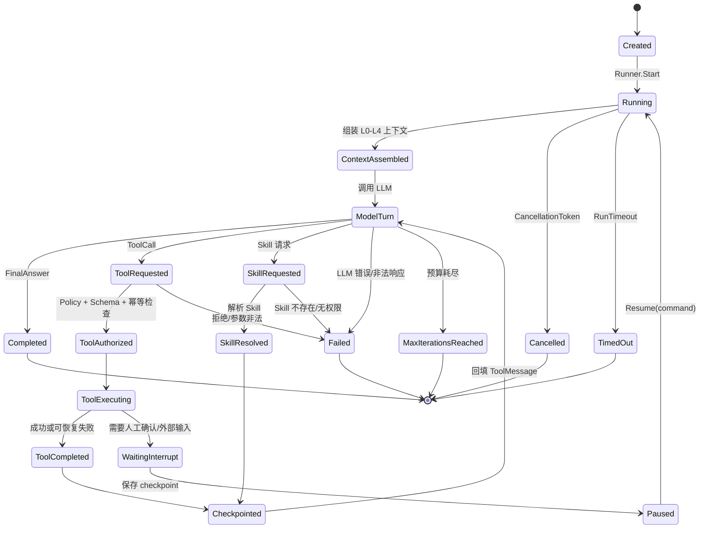

### 状态约束

- 所有状态迁移生成单调递增的 `RunEvent.Sequence`；
- `WaitingInterrupt`、`Paused` 只保存公开状态和恢复所需数据，不保存隐藏推理内容；
- 断点恢复必须先读取已完成的 `ToolCall`，已成功且幂等键相同的调用直接 Replay；
- SSE 连接断开不等于 Run 失败，Runtime 继续完成或记录最终终态；
- `completed` 之外的终态不能被 Chat 层当成成功对话轮次写入。

## 三、消息路由与多 Agent 协作

多 Agent 不再通过拼接长字符串传递上下文，而使用带关联信息的消息和 Artifact：

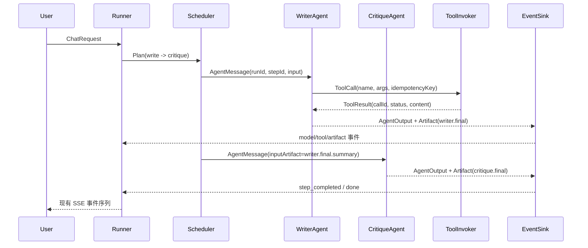

### 结构化消息 envelope

```json
{
  "runId": "run-123",
  "stepId": "critique",
  "messageId": "msg-456",
  "correlationId": "writer.final",
  "sender": "writer",
  "recipient": "critique",
  "type": "artifact.input",
  "payload": {
    "artifactId": "artifact-789",
    "contentType": "text/markdown",
    "summary": "章节初稿摘要",
    "contentRef": "artifact-789"
  }
}
```

`payload.content` 是否携带正文由 Token 预算决定：默认传递摘要和引用，只有剩余预算足够时才加载正文。模型不能自行修改 `recipient`、Tool 权限或计划依赖。

## 四、RunContext 与分层记忆的关系

`RunContext` 是运行时元数据容器，不是把所有历史直接塞进 Prompt：

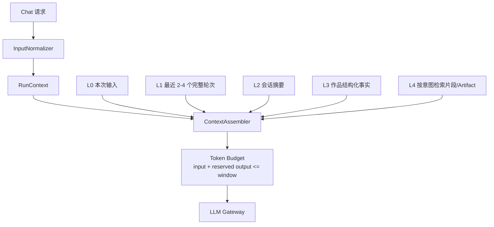

推荐优先级：`L3 → L2 → L4 → L1 → L0`。裁剪顺序：先删 L4，再压缩 L2，最后减少 L1，但不能拆开一个 user/assistant 完整轮次。

记忆刷新与 Run 解耦：Chat 事务先提交消息和 Run 结果，再发布 `MemoryRefreshRequested`；后台 Worker 按 `VersionTurn` 做 Snapshot/Facts 的条件 Upsert，失败只标记 `stale` 并重试，不回滚已完成 Chat。

## 五、内部事件与现有 SSE 的兼容投影

Runtime 内部事件建议统一为以下类型：

```text
run_created
run_started
step_started
model_turn_started
model_chunk
tool_call_requested
tool_call_started
tool_result
skill_resolved
artifact_created
checkpoint_saved
interrupt_requested
step_completed
run_completed
run_failed
run_cancelled
```

兼容层负责将这些事件投影成当前客户端已认识的 SSE 类型：

| Runtime 内部事件 | 现有 SSE 投影 | 兼容要求 |
|---|---|---|
| `model_chunk` | 现有 `content` / `reasoning` | 内容字段和顺序保持不变 |
| `tool_result` | 现有 `tool_result` | Tool 名称、结果结构不变 |
| `step_started` | 现有 `agent_start` 或对应事件 | 保留旧字段，新增字段只向后兼容 |
| `artifact_created` | 现有完成/结果事件 | 正文仍按原协议返回，Artifact ID 放入扩展元数据 |
| `run_completed` | `done` | `stopReason=completed` |
| `run_failed` | `error` + `done` | 错误文本和终态语义明确 |

建议在 `meta` 中逐步增加 `runId`、`stepId`、`sequence`；旧客户端忽略新增字段即可。

## 六、与现有代码的映射

```text
AgentRoute
  → AgentApplication
      → CreationRuntimeFacade（新增，兼容 CreationOrchestrator）
          → AgentRuntime.Runner
              → RuntimeHost / AgentLoop
                  → ContextAssembler
                  → StepScheduler
                  → AgentInvoker
                      → 现有 INovelAgent / ReActAgent 兼容 Facade
                  → LegacyToolInvokerAdapter
                      → 现有 IToolCapable + WorkToolExecutionGuard
                  → LegacySkillResolverAdapter
                      → 现有 ISkilCapable + SKILL.md
                  → Checkpoint/Event/Artifact Store
          → SSE Projector
```

迁移期间保留双模式开关：

```text
AiRuntime:Mode = legacy | agent-loop
```

默认先在测试和灰度环境开启 `agent-loop`，发现行为差异时可回退到 `legacy`；两条路径必须共用 Tool、Skill、SSE 和数据库兼容适配器。

## 七、设计取舍

| 方向 | 采用方式 | 不直接照搬的部分 |
|---|---|---|
| AutoGen | 消息 envelope、Agent identity、Runtime host、路由生命周期 | 不引入其协议栈和分布式 Runtime |
| LangGraph | 显式状态、checkpoint、interrupt/resume、可恢复执行 | 不把所有业务建模成通用图 DSL；第一阶段仍以线性 Plan 为主 |
| OpenAI Agents SDK | Runner、RunContext、Tool invocation、streaming event | 不绑定 OpenAI 专有模型或托管执行服务 |
| AINWZ 现有系统 | API/SSE/Tool/Skill/数据库兼容 Facade | 不让兼容层反向污染 Runtime 核心 |

推荐方案是“内部 Runtime 内核 + 兼容适配层 + 结构化消息/Artifact + 可选 checkpoint”。它能覆盖当前单 Agent 和线性多 Agent，又为暂停恢复、人工确认和 DAG 扩展保留边界。

## 八、实施顺序（仅架构建议）

1. 冻结 API、SSE、Tool、Skill 的行为契约，补充回归测试；
2. 把现有 `AgentLoop` 收敛为 `RuntimeHost + RunContext + EventSink`；
3. 引入 `CreationRuntimeFacade`，让 `CreationOrchestrator` 只负责兼容映射；
4. 接入 Run/Step/Event/ToolCall/Artifact 的持久化和幂等；
5. 将记忆刷新移到后台 Worker，并启用版本化 Snapshot/Facts；
6. 线性 Pipeline 稳定后，再开放受约束 DAG 与 interrupt/resume。

## 九、Prompt-light Agent：Agent 不再维护“大而全”的 Prompt

### 9.1 问题定位

当前 `BuildPrompt()` 混合了五类内容：

1. Agent 身份和输出风格；
2. 任务目标和用户约束；
3. Tool 调用顺序和业务流程；
4. 作品记忆、章节规则和上下文；
5. 预算、停止条件、失败重试和持久化动作。

其中第 3、4、5 类不应由 Agent Prompt 控制。它们必须由 Runtime 的 Plan、Policy、Tool Registry 和 ContextAssembler 负责。否则每新增一个 Agent，就要复制一套流程 Prompt，最终形成难以测试和维护的“Prompt Workflow”。

### 9.2 新的 Agent 定义

Agent 从“Prompt 脚本”变成“能力声明”：

```csharp
public sealed class AgentDescriptor
{
    public string Name { get; init; }
    public string DisplayName { get; init; }
    public string Domain { get; init; }
    public IReadOnlyList<string> InputKinds { get; init; }
    public string OutputKind { get; init; }
    public string PromptProfileKey { get; init; }
    public string PolicyProfileKey { get; init; }
    public IReadOnlyList<string> ToolGroups { get; init; }
    public IReadOnlyList<string> MemoryScopes { get; init; }
}
```

一个新的 Agent 最少只需要声明：

- 它处理什么类型的任务（`Domain` / `InputKinds`）；
- 它产生什么类型的结果（`OutputKind`）；
- 允许访问哪些 Tool 组和记忆范围；
- 使用哪个可复用的 Prompt Profile 和 Policy Profile。

旧的 `BuildPrompt()` 继续保留在兼容接口中，但只作为迁移适配器；新 Agent 不再实现它。

### 9.3 Prompt 由 Runtime 动态编译

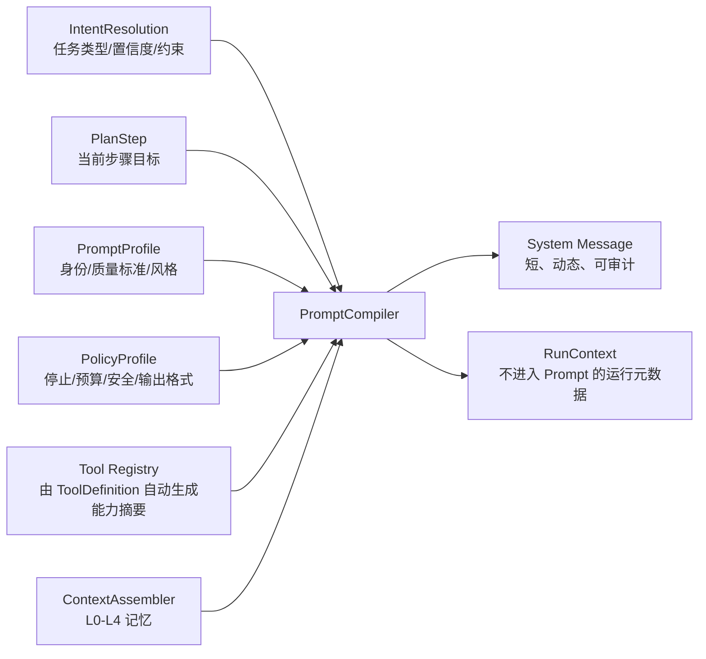

`PromptCompiler` 的固定组成顺序为：

```text
身份（短）
→ 当前步骤目标（来自 Plan，不来自 Agent 自己编排）
→ 用户约束（来自请求规范化）
→ 质量标准（可复用 rubric）
→ 相关记忆（按预算注入）
→ 可用能力摘要（由 Tool Registry 生成）
→ 输出契约（结构化边界 + 兼容文本格式）
```

以下内容明确禁止放入 Agent Prompt：

- “必须先调用 A，再调用 B”的固定 Tool 顺序；
- 最大迭代次数、超时、取消、幂等和权限规则；
- 数据库保存、摘要刷新、Artifact 写入等副作用流程；
- 完整作品规则、全量章节历史和未请求的 Tool Schema；
- Thought/Action/Observation 等内部推理格式要求。

### 9.4 流程从 Prompt 移到 Plan 和 Policy

以写作任务为例，Agent 不再提示“必须调用 20 多个工具并按四个阶段执行”，而是由 Runtime 声明：

```json
{
  "stepId": "write.chapter",
  "agent": "write",
  "objective": "完成当前章节正文",
  "allowedToolGroups": ["work.read", "chapter.read", "chapter.write", "story.consistency"],
  "requiredChecks": ["context.loaded", "writing.constraints.loaded"],
  "completion": {
    "requiredArtifact": "chapter.content",
    "persistWith": "save_chapter_content"
  },
  "policy": {
    "maxIterations": 8,
    "maxToolCalls": 20,
    "sideEffects": "journaled"
  }
}
```

Runtime 根据 `requiredChecks`、Tool 分组、幂等状态和 Artifact 依赖决定下一步动作；模型只负责生成内容或请求已暴露的能力。这样 Tool 名称和 Schema 仍保持不变，但不需要在 Prompt 中手工维护调用目录。

### 9.5 Agent 类的目标形态

```csharp
public sealed class WriteAgent : IAgentDefinition
{
    public AgentDescriptor Descriptor => new()
    {
        Name = "write",
        DisplayName = "写作Agent",
        Domain = "novel.writing",
        InputKinds = ["chapter.request", "revision.request"],
        OutputKind = "chapter.content",
        PromptProfileKey = "novel.writer",
        PolicyProfileKey = "writing.safe-default",
        ToolGroups = ["work.read", "chapter.read", "chapter.write", "story.consistency"],
        MemoryScopes = ["session", "project", "recent-chapters"]
    };
}
```

它不再包含：

- `BuildPrompt()` 中数百行写作法典；
- 工具调用阶段和严格顺序；
- 章节保存、摘要更新、关系维护等副作用指令；
- ReAct 循环说明。

这些内容分别由 `PromptProfile`、`PlanCompiler`、`PolicyProfile`、`ToolInvoker` 和 `ArtifactStore` 管理，并可以独立测试和版本化。

### 9.6 兼容迁移

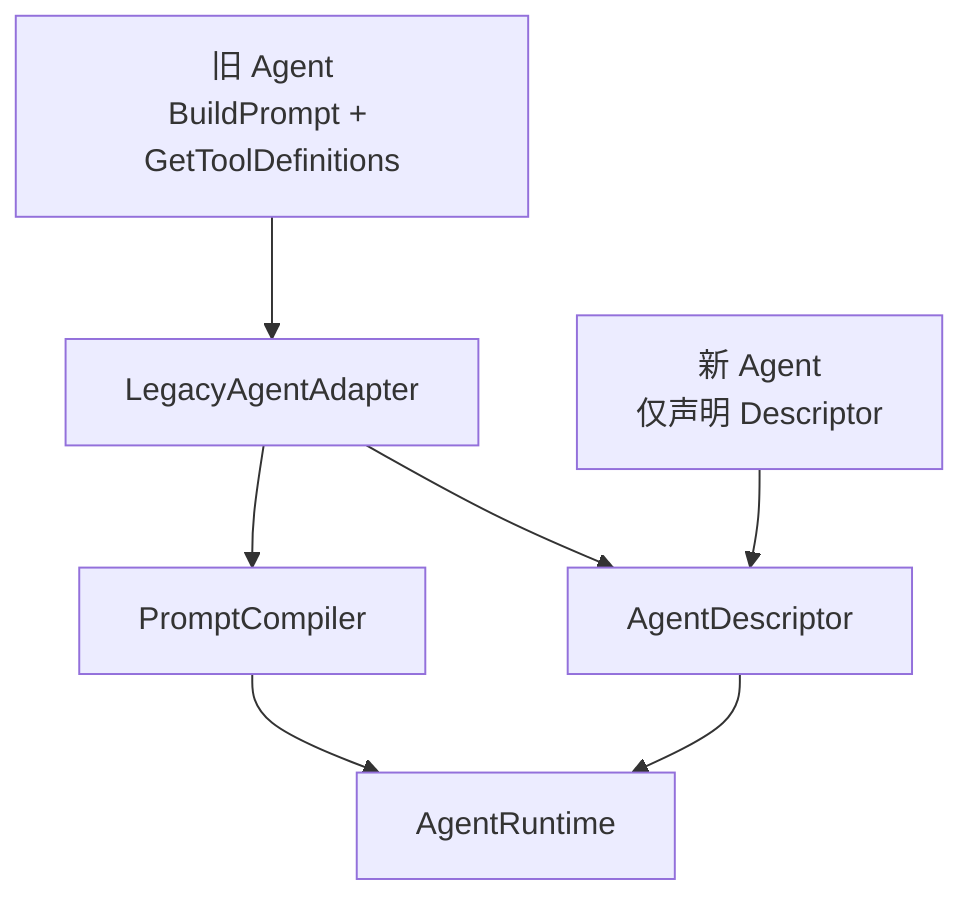

迁移顺序建议：

1. 先把旧长 Prompt 拆成可复用的 `PromptProfile` 和 `PolicyProfile`，保持内容行为不变；
2. 再把固定 Tool 顺序转换为 `requiredChecks`、`allowedToolGroups` 和 Artifact 依赖；
3. 最后删除新 Agent 对 `BuildPrompt()` 的实现，旧 Agent 继续通过 Adapter 运行；
4. 每一步都使用同一套 SSE、Tool Journal 和数据库兼容层，确保可回滚。

### 9.7 预期收益

| 维度 | 当前方式 | Prompt-light 方式 |
|---|---|---|
| 新增 Agent | 复制一份长 Prompt 和工具流程 | 新增 Descriptor，复用 Profile/Policy |
| Tool 调度 | Prompt 文字约束，容易漂移 | Registry + Policy + Runtime 状态机 |
| 记忆注入 | Agent 自己要求查哪些内容 | ContextAssembler 按意图和预算统一组装 |
| 失败/重试 | Prompt 描述，模型不一定遵守 | Runtime 强制执行、可审计、可恢复 |
| 风格调整 | 修改 Agent 源码中的长字符串 | 修改版本化 PromptProfile |
| API/SSE/Tool 兼容 | 容易被 Prompt 重构影响 | 由 Compatibility Facade 固定边界 |

## 十、人物自生长：CharacterRuntime 与 CharacterStateMachine

### 10.1 设计目标

人物不再只是 `CharacterEntity` 中的一组静态资料，也不依赖写作 Agent 在 Prompt 中手工维护性格变化。人物成长由剧情事件驱动，并通过“证据 → 变化提案 → 一致性校验 → 版本化提交”形成可追溯状态。

当前实体继续保留：

```text
CharacterEntity       稳定身份与基础资料
CharacterArcEntity    面向用户的阶段性成长弧线
CharacterRelationshipEntity / CharacterGraphEntity
                       关系和图谱兼容模型
```

新增 Runtime 内部模型：

```text
CharacterStateSnapshot    某一事件版本下的人物完整状态
CharacterStateEvent       由章节/剧情事件产生的状态变化证据
CharacterGoal             当前目标、需求和进度
CharacterConflict         未解决的内部矛盾
CharacterGrowthProposal   待确认或待校验的重大变化
PlotHookProposal          根据人物状态生成的候选剧情钩子
```

### 10.2 人物状态分层

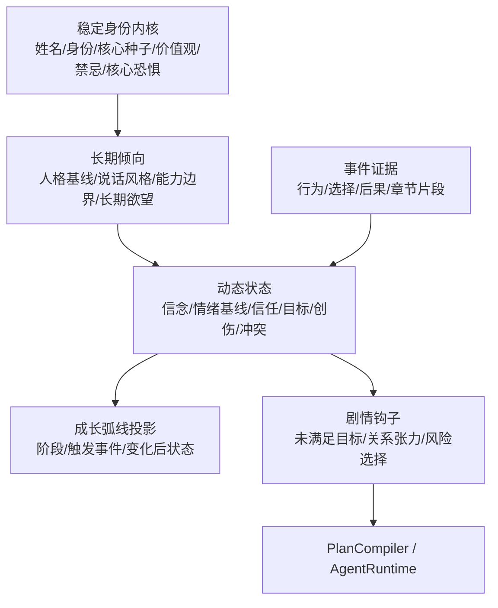

状态变化的基本规则：

```text
CharacterEntity.Personality/Motivation
    = 稳定身份和长期倾向的兼容投影

CharacterStateSnapshot
    = 当前可变状态的唯一读取来源

CharacterStateEvent
    = 所有状态变化的证据和审计来源

CharacterArcEntity
    = 状态事件聚合后的用户可见成长阶段
```

### 10.3 章节完成后的自生长流程

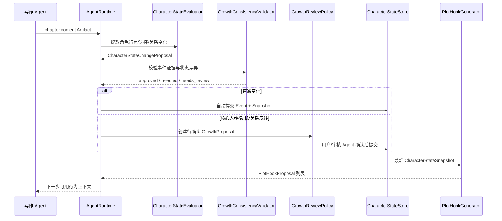

### 10.4 状态变化的确认策略

采用“自动分析，重要变化需确认”的边界：

| 变化类型 | 默认处理 | 示例 |
|---|---|---|
| 情绪短期波动 | 自动提交 | 恐惧、愤怒、羞愧、紧张 |
| 短期目标/行动意图 | 自动提交 | 想调查、想逃离、想保护某人 |
| 关系轻微变化 | 自动提交 | 信任下降 0.1、关系紧张度上升 |
| 新的内部冲突 | 自动提交 | 复仇欲与自我克制同时增强 |
| 核心价值观变化 | 待确认 | 从“遵守承诺”转为“只相信结果” |
| 核心动机变化 | 待确认 | 从“保护家人”转为“追求权力” |
| 重大关系反转 | 待确认 | 师徒关系转为敌对 |
| 永久性人格改变 | 待确认 | 内向谨慎转为持续冒险激进 |

`needs_review` 不阻塞当前 Chat；当前章节可以正常完成，待确认变化只影响后续 Runtime 读取的“候选状态”，不能覆盖已确认状态。

### 10.5 状态变化提案

```json
{
  "proposalId": "growth-123",
  "characterId": "char-001",
  "sourceRunId": "run-456",
  "sourceChapterId": "chapter-12",
  "severity": "major",
  "evidence": [
    {
      "quote": "他收起了已经出鞘的刀，转身去找账册。",
      "type": "decision"
    }
  ],
  "changes": [
    {
      "dimension": "impulse_control",
      "from": 0.25,
      "to": 0.48
    },
    {
      "dimension": "trust_in_mentor",
      "from": 0.30,
      "to": -0.65
    }
  ],
  "reason": "角色在遭遇背叛线索后选择调查而非立即复仇",
  "status": "needs_review"
}
```

提案必须绑定 `sourceRunId`、章节或 Artifact、证据片段、前后状态和置信度，禁止没有证据的“模型印象式”成长。

### 10.6 CharacterBehaviorContext

写作 Agent 不再接收完整人物数据库记录和长篇成长 Prompt，而是由 Runtime 生成短的行为上下文：

```text
稳定价值观：重视承诺，不接受无证据的背叛判断
当前主要目标：查明师父隐瞒的真相
当前心理压力：0.78
对林舟的信任：-0.35
行为倾向：先观察和试探，不立即冲动行动
未解决矛盾：渴望认可，但害怕再次被利用
本章允许变化：信任进一步下降，或获得一条新证据
```

这个上下文属于 `ContextAssembler` 的动态输入，不属于 Agent 固定 Prompt。人物的行为由状态、事件和当前任务共同决定，因此同一个 Agent 可以驱动不同人物而不需要复制人物专用 Prompt。

### 10.7 从人物状态生成可拓展剧情

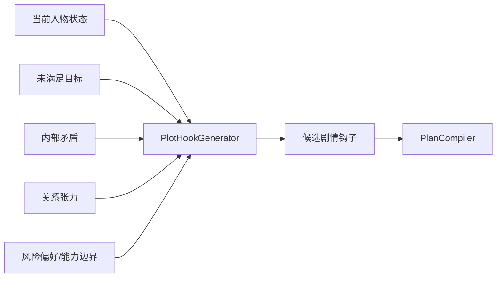

示例：

```text
目标：查明师父隐瞒的真相
恐惧：再次被亲近的人利用
关系：对师父信任下降
矛盾：想质问，但担心证据不足

候选钩子：
1. 暗中调查账册；
2. 试探性询问师父；
3. 制造假情报观察对方反应；
4. 暂时压下怀疑，但与同伴关系恶化。
```

候选钩子不是强制剧情。`PlanCompiler` 仍需结合用户意图、作品大纲、时间线和当前 Run 预算决定是否采用。

### 10.8 数据兼容与迁移

不修改旧 API 的字段语义，不删除历史表。新增表采用追加式迁移：

```text
CharacterStateEvents
  (Id, WorkId, CharacterId, SourceRunId, SourceChapterId,
   EventType, EvidenceJson, ChangesJson, Confidence, Version)

CharacterStateSnapshots
  (Id, WorkId, CharacterId, BasedOnEventId,
   StateJson, Version, Status, UpdatedAt)

CharacterGrowthProposals
  (Id, WorkId, CharacterId, SourceRunId,
   ProposalJson, Severity, Status, ReviewedBy, ReviewedAt)
```

兼容规则：

- 旧 `CharacterEntity` 继续支持现有创建、更新和查询 API；
- 旧 `update_character` Tool 继续可用，但重大变化应同时创建 `CharacterStateEvent`；
- 旧 `create_character_arc` Tool 继续写入 `CharacterArcEntity`，后台可由事件聚合生成阶段建议；
- 新 Runtime 读取最新已确认 Snapshot，若不存在则从旧 `CharacterEntity` 初始化一个基线快照；
- 候选状态与已确认状态分离，旧数据不会被自动重写；
- 所有 Snapshot 更新使用版本比较，旧事件不能覆盖新状态。

### 10.9 验收标准

- 人物状态变化必须可追溯到 Run、章节或 Artifact 证据；
- 普通状态变化自动生效，核心人格/动机/关系反转进入待确认；
- 当前章节完成不依赖成长分析成功，分析失败只影响后续记忆刷新；
- 写作 Agent Prompt 不包含人物成长流程和固定 Tool 顺序；
- `CharacterEntity`、`CharacterArcEntity`、现有 Tool 名称和 API 行为保持兼容；
- 同一人物的状态快照支持版本比较、并发刷新和回滚；
- 由人物状态生成的剧情钩子必须经过 PlanCompiler 校验后才能进入执行计划。

## 十一、现有实体审查与演进方案

### 11.1 已确认的实体职责

现有实体可以继续作为兼容基础，但不应直接重写或删除。最终职责确定为：

```text
CharacterEntity
  = 稳定人物档案 + 旧 API 兼容投影

CharacterStateEvent
  = 人物状态变化的事实和证据来源

CharacterStateSnapshot
  = 当前已确认动态状态的唯一读取源

CharacterArcEntity
  = 面向用户的成长阶段投影

CharacterRelationshipEntity
  = 当前关系状态投影

RelationshipStateEvent
  = 关系变化的历史事实和证据来源

CharacterGraphEntity / Node / Edge
  = 可重建的关系图谱展示投影
```

### 11.2 现有实体的改进点

| 实体 | 当前风险 | 演进方向 |
|---|---|---|
| `CharacterEntity` | `Personality`、`Motivation` 容易被当成动态状态覆盖 | 保留字段语义，Runtime 不直接覆盖；动态变化写事件/快照 |
| `CharacterArcEntity` | 缺少章节、Run、证据、置信度和版本 | 保留旧字段，新增事件关联和状态投影能力 |
| `CharacterRelationshipEntity` | 只有当前值，没有历史和证据；强度无范围约束 | 增加关系事件、有效区间、置信度和版本 |
| `TimelineEventEntity` | 缺少来源 Run、Artifact、证据片段 | 作为人物状态事件的重要来源之一 |
| `CharacterGraph*` | 与关系实体存在重复事实，可能漂移 | 关系实体为事实源，图谱按版本重建 |
| `AICreationMessageEntity` | 缺少完整 Run/Step 关联 | 新消息通过 Runtime 关联，历史消息继续可读 |
| 基础 `Entity` | `DateTime.Now` 与 UTC 注释不一致 | 统一由基础设施写 UTC，逐步迁移到 `DateTimeOffset` |

### 11.3 新增状态模型（非破坏式）

```text
CharacterStateEvents
  Id, WorkId, CharacterId, SourceRunId, SourceChapterId,
  EventType, EvidenceJson, ChangesJson, Confidence, Version,
  CreatedAt, CreateBy

CharacterStateSnapshots
  Id, WorkId, CharacterId, BasedOnEventId,
  StateJson, Version, Status, UpdatedAt, UpdateBy

CharacterGrowthProposals
  Id, WorkId, CharacterId, SourceRunId,
  ProposalJson, Severity, Status, ReviewedBy, ReviewedAt

RelationshipStateEvents
  Id, WorkId, SourceCharacterId, TargetCharacterId,
  SourceRunId, SourceChapterId, ChangesJson, EvidenceJson,
  Confidence, Version
```

这些表采用追加式迁移，不改变已有表的列含义。若某角色尚无状态快照，Runtime 首次读取时根据 `CharacterEntity` 初始化一个基线快照。

### 11.4 并发和版本规则

- `CharacterStateEvent` 只能追加，不能更新历史证据；
- `CharacterStateSnapshot` 使用整数 `Version` 或并发 Token，更新时必须比较版本；
- 旧版本分析结果完成较晚时，只能被丢弃，不能覆盖新状态；
- `CharacterGrowthProposal` 的候选状态与已确认状态分离；
- 重大状态确认后才允许更新 `CharacterEntity` 的兼容字段；
- 同一角色同一来源事件使用幂等键，防止章节重试产生重复成长事件。

### 11.5 关系和图谱的一致性

`CharacterRelationshipEntity` 是关系事实源，至少需要在应用层校验：

```text
SourceCharacterId != TargetCharacterId
Intensity ∈ [0, 100]
RelationshipType 非空且属于注册类型
同一 Work + Source + Target + Type 只有一个当前投影
```

`CharacterGraphEdgeEntity` 只保存展示所需的节点连线和布局信息。关系变化发生时先写 `RelationshipStateEvent`，再刷新关系投影和图谱版本，避免 Agent 同时写两套事实。

### 11.6 迁移顺序

1. 统一时间写入策略和状态/类型常量校验，不改变 API 返回值；
2. 新增 `CharacterStateEvents`、`CharacterStateSnapshots`、`CharacterGrowthProposals`；
3. Runtime 写入人物事件并读取最新已确认 Snapshot；
4. 将现有 `CharacterArcEntity` 作为事件聚合后的兼容视图；
5. 增加关系状态事件，明确关系实体为事实源；
6. 最后再考虑将 JSON 集合字段拆为规范化关联表；旧 JSON 字段在迁移期间继续保留。

### 11.7 实体层验收标准

- 历史 `CharacterEntity` 数据无需回填即可被 Runtime 使用；
- 旧 `create_character`、`update_character`、`create_character_arc` Tool 契约不变；
- 人物每次动态变化都能追溯到章节、Artifact 或 Run；
- 核心人格变化不会被后台任务静默覆盖；
- 并发成长分析不会发生旧版本覆盖新版本；
- 图谱展示可以从关系事实重新生成；
- 现有 API、SSE、Tool 名称和数据库历史数据保持兼容。

## 十二、Tool 数量与暴露策略

### 12.1 决策结论

不删除现有 Tool，也不修改现有 Tool 名称、参数 Schema 和返回契约；但不再把全量 Tool 同时暴露给模型。

```text
代码层面：保留全部 Tool 实现
注册层面：全部注册到 Tool Registry
Runtime 层面：按 Agent + PlanStep + Phase 动态筛选
模型层面：只看到当前任务需要的最小 Tool 集合
兼容层面：旧 Tool 名称通过 LegacyToolAdapter 持续可用
```

当前约 47 个业务 Tool（查询类约 25 个、写入类约 22 个），数量本身不是删除理由；真正需要控制的是单次 Run 的 Tool Schema 数量、权限范围和模型选择空间。

### 12.2 Tool Registry 与能力分组

Tool Registry 保存兼容元数据和运行时策略：

```csharp
public sealed class ToolCapabilityDescriptor
{
    public string Name { get; init; }
    public string Group { get; init; }
    public string RiskLevel { get; init; }
    public bool ReadOnly { get; init; }
    public bool RequiresExplicitConsent { get; init; }
    public IReadOnlyList<string> RequiredScopes { get; init; }
    public IReadOnlyList<string> RequiredPhases { get; init; }
}
```

建议的能力分组：

```text
work.read
chapter.read
chapter.write
character.read
character.write
character.growth
relationship.read
relationship.write
world.read
world.write
outline.read
outline.write
story.consistency
graph.internal
system.high-risk
```

Agent 只声明允许的能力组，不维护逐个 Tool 的长 Prompt：

```json
{
  "agent": "write",
  "toolGroups": [
    "work.read",
    "chapter.read",
    "character.read",
    "world.read",
    "story.consistency",
    "chapter.write"
  ]
}
```

### 12.3 按执行阶段暴露最小集合

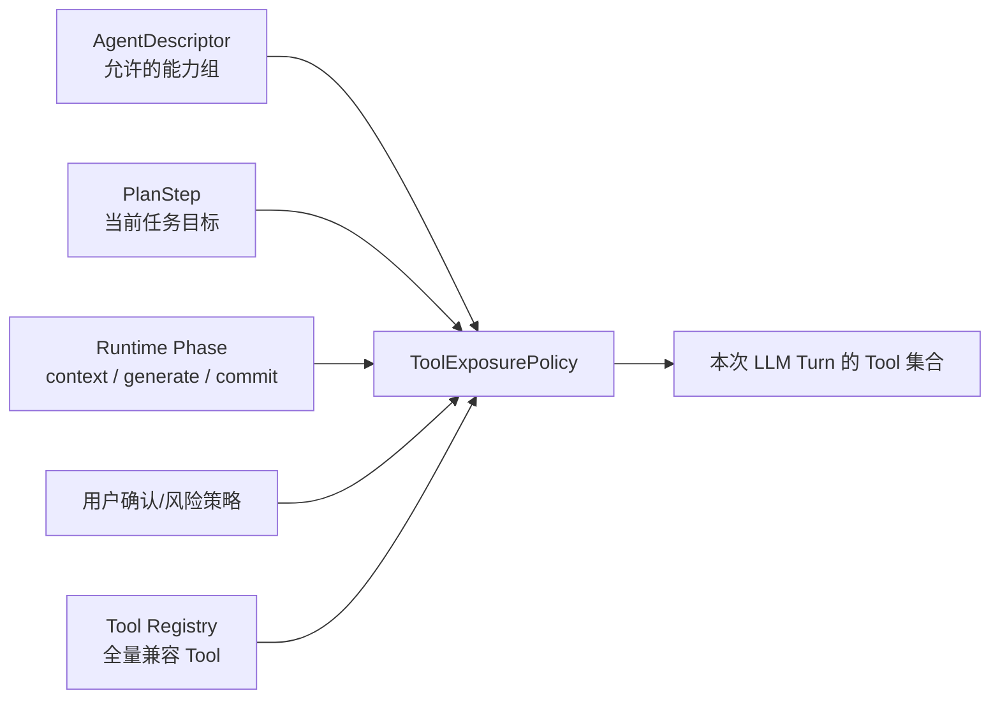

以章节写作为例：

```json
{
  "phase": "context_loading",
  "expose": [
    "get_work_info",
    "get_outline",
    "get_recent_chapters",
    "get_character",
    "get_world_setting",
    "get_writing_rules"
  ]
}
```

```json
{
  "phase": "commit",
  "expose": [
    "save_chapter_content",
    "update_chapter_summary",
    "create_timeline_event",
    "create_character_arc"
  ]
}
```

建议约束：

```text
普通 Agent：6–12 个 Tool
复杂审核：最多约 15 个只读 Tool
高风险 Tool：默认 0 个，必须显式授权
全量 Tool：只存在于 Registry，不直接注入模型上下文
```

### 12.4 低层 Tool 下沉为 Runtime 内部能力

以下能力不应作为模型主要决策对象：

```text
create_character_graph
create_character_graph_node
create_character_graph_edge
```

它们是图谱持久化细节。模型表达“更新人物关系”后，Runtime 通过内部 Use Case 完成：

```text
CharacterRelationship 更新
  → RelationshipStateEvent 追加
  → Graph Projection 刷新
  → 图谱版本递增
```

旧 Tool 仍由 `LegacyToolAdapter` 支持，已有 API、Skill 或历史 Run 不会失效。

### 12.5 Tool 实现复用，而非 Tool 合约合并

多个外部 Tool 可以复用同一 Application Use Case：

```text
get_character
get_character_list
search_characters
        ↓
CharacterQueryService

create_character
update_character
        ↓
SaveCharacterCommandHandler
```

兼容层仍保留原有入口：

```text
create_character → SaveCharacterCommandHandler(Create)
update_character → SaveCharacterCommandHandler(Update)
```

这样可以减少业务实现重复，同时不会破坏 Tool 名称和参数 Schema。

### 12.6 高风险 Tool 策略

```text
PowerShell
WebSearch
Agent Browser
SkillFindTool
```

这些能力必须经过：

1. AgentDescriptor 能力声明；
2. 当前 PlanStep 允许；
3. 用户或系统策略明确授权；
4. `IToolExecutionGuard` 权限检查；
5. ToolCall Journal 审计和幂等处理。

默认情况下，普通写作、角色创建和审核 Run 不暴露 `system.high-risk`。

### 12.7 迁移顺序

1. 为现有 Tool 补齐 `Group`、`RiskLevel`、`ReadOnly` 和 `RequiredPhases` 元数据；
2. 建立 Tool Registry，但保持现有 DI 注册和 Tool 名称不变；
3. 在 AgentRuntime 中增加 `ToolExposurePolicy`，先以“全量兼容模式”运行；
4. 按 Agent 和 PlanStep 启用最小暴露集合，记录误调用和缺少 Tool 指标；
5. 将图谱节点/边等低层 Tool 下沉为内部 Use Case，保留 LegacyToolAdapter；
6. 对重复查询/写入 Tool 统一内部 Handler，外部契约继续分开；
7. 稳定后再收紧高风险 Tool 的默认授权。

### 12.8 验收标准

- 现有 Tool 名称、参数 Schema、返回格式和 Guard 行为不变；
- 任意 Run 的模型可见 Tool 数量受 `ToolExposurePolicy` 限制；
- 未授权的写入或高风险 Tool 在 Runtime 层被拒绝；
- Tool Schema 不再通过 Agent 长 Prompt 手工维护；
- 图谱展示可以由关系事实重建，低层图谱 Tool 不参与普通写作决策；
- 重试和恢复不会重复执行有副作用的 Tool；
- 旧 API、SSE、Skill 和历史 Run 仍可通过兼容层执行。

## 十三、2026-09-04 实施状态与边界

当前实现已经形成可运行的 `AgentRuntime + AgentLoop` 核心链路：

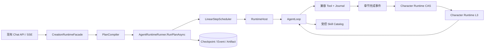

已经完成：

- Runner 统一调度完整 Plan，校验依赖与环，使用运行级单调事件序列，并保存 Step Checkpoint 和 Artifact；
- Tool 名称、Schema、返回值与 Guard 保持不变，Tool 幂等键按 `(RunId, StepId, ToolCallId)` 隔离；
- Descriptor 驱动最小 Tool 暴露，空能力组 fail-closed，`MaxTools=0` 不暴露任何 Tool，高风险能力默认关闭；
- PromptCompiler 进入真实执行路径，Agent Profile 只描述身份、目标、质量标准和能力，不复制当前用户输入，也不规定固定 Tool 顺序；
- Skill Catalog 从 ContentRoot 下的 `wwwroot/skills/**/SKILL.md` 加载，Runtime Resolver 注入正文而不是仅注入描述；
- 章节 Artifact 触发后台人物提案抽取，证据必须出现在正文中；Event 与 Snapshot 事务 CAS，冲突后 rebase；
- 已确认人物快照和剧情钩子通过 `[Character Runtime]` L3 动态上下文反馈给下一轮 Agent；
- MemoryRefresh 与 Chat 提交解耦，失败重试并标记 `stale`；Snapshot、历史消息和 Checkpoint 都有版本或稳定顺序保护；
- 现有 API、SSE 类型、Tool/Skill 入口和历史数据库表保持兼容，迁移只扩展 ToolCall 唯一索引。

明确保留到下一阶段：

- MemoryRefresh 当前是进程内合并队列，不是 durable outbox；进程重启可能丢失尚未处理的刷新请求；
- Checkpoint 和 Tool Replay 已具备内部恢复基础，但尚无外部 `interrupt/resume` API、跨实例运行租约和自动接管；
- Scheduler 当前按依赖顺序串行执行受约束 DAG，不并行调度无副作用 Step；
- 生产配置仍默认 `legacy` 以便灰度回滚，开发环境启用 `agent-loop`；切换生产默认值需要兼容性与运行指标验收；
- 真实 PostgreSQL 的多实例故障注入、进程崩溃恢复和 durable queue 集成测试尚待补充。

这些边界是显式阶段划分，不代表上述能力已经由当前实现提供。

## 参考项目

- [Microsoft AutoGen](https://github.com/microsoft/autogen)
- [LangGraph](https://github.com/langchain-ai/langgraph)
- [OpenAI Agents SDK](https://github.com/openai/openai-agents-python)
- [Microsoft Agent Framework](https://github.com/microsoft/agent-framework)
